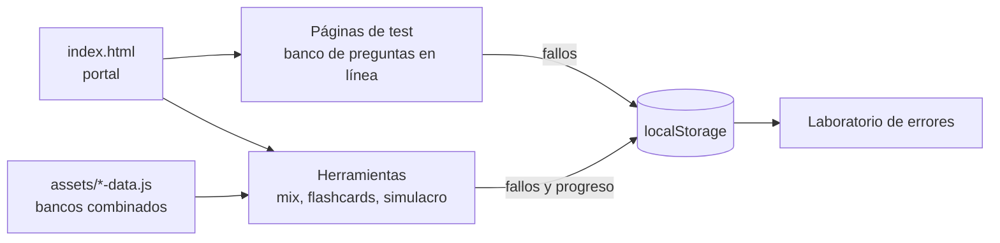

# Interactive Test Platform

Portal web de tests autocorregibles, flashcards y simulacros de examen que uso para preparar las asignaturas de 1º de ASIR.

Demo: https://ndoreste.github.io/interactive-test-platform/

## Problema

Repasar para los exámenes tipo test de ASIR a partir de apuntes, PDF y cuestionarios sueltos es lento: no hay forma cómoda de hacer intentos aleatorios, aplicar la misma penalización que en el examen real ni volver solo sobre las preguntas que se fallan.

## Solución

Una web estática, sin servidor ni proceso de build, donde cada asignatura tiene su banco de preguntas. Cada intento saca preguntas aleatorias, corrige con el sistema de puntuación del examen (+0,33 por acierto, −0,11 por fallo, 0 en blanco) y guarda los fallos en el navegador para practicarlos después.

## Características

- **Tests por asignatura**: 12 tests (Bases de Datos, Fundamentos de Hardware, Implantación de SO, Lenguaje de Marcas, Redes, Cloud, IPE y varios repasos). Cada intento muestra hasta 30 preguntas aleatorias del banco y al corregir indica aciertos, fallos, blancos, puntuación y porcentaje.
- **Exámenes de mayo 2026**: 5 tests de 30 preguntas en orden fijo (BBDD, LMSGI, MPO, PAR e IPE).
- **Laboratorio de errores**: cada pregunta fallada en los tests por asignatura, los exámenes de mayo o el Mix Test se guarda en `localStorage` con un contador de fallos; el laboratorio genera un test de hasta 30 preguntas solo con esas.
- **Simulacro del día del examen**: 7 módulos que se desbloquean en orden, 30 preguntas por módulo y cuenta atrás de 1 hora. El progreso se guarda en `localStorage`, así que se puede salir y reanudar; al terminar muestra la nota sobre 10 de cada módulo y la media global.
- **Mix Test**: 30 preguntas mezcladas de todas las asignaturas, con al menos una de cada una.
- **Flashcards Mix**: 30 tarjetas aleatorias con la pregunta delante y la respuesta correcta detrás.
- El repaso de Redes incluye la explicación de cada respuesta.
- Diseño adaptado a móvil y respeto de `prefers-reduced-motion`.

### Contenido

Recuento hecho sobre los datos del repositorio:

| Test | Preguntas |
|------|-----------|
| Redes (PAR) | 232 |
| Lenguaje de Marcas | 224 |
| IPE completo | 168 |
| Fundamentos de Hardware – repaso final | 140 |
| Cloud | 108 |
| Repaso Redes (con explicación) | 100 |
| Fundamentos de Hardware | 88 |
| Implantación de SO | 70 |
| Bases de Datos | 50 |
| ITPE repaso 1 | 40 |
| ITPE repaso 2 | 40 |
| Nube repaso completo | 37 |
| Exámenes mayo 2026 (5 × 30) | 150 |

Mix Test y Flashcards Mix usan un banco combinado de 1.152 preguntas, y el simulacro reutiliza los bancos de 7 asignaturas.

## Arquitectura



- Cada página es un HTML independiente con un componente React escrito en JSX y transformado en el navegador con Babel Standalone.
- Los tests por asignatura llevan su banco dentro de la propia página (`enunciado`, `opciones`, `correcta`). Las herramientas cargan bancos combinados desde `assets/*-data.js`.
- `assets/error-lab.js` expone `window.ErrorLab`, que las páginas de test y el Mix Test usan para registrar los fallos.
- `style.css` es la hoja de estilos compartida por todo el sitio.

## Stack

- HTML, CSS y JavaScript
- React 18 (UMD) y Babel Standalone cargados desde unpkg
- `localStorage` para fallos y progreso del simulacro
- Fuentes: Inter (Google Fonts) y Major Mono Display
- GitHub Pages para el despliegue

## Uso

Demo publicada: https://ndoreste.github.io/interactive-test-platform/

Para ejecutarlo en local basta con un servidor estático:

```bash
git clone https://github.com/ndoreste/interactive-test-platform.git
cd interactive-test-platform
python -m http.server 8000
```

Después se abre `http://localhost:8000`. Hace falta conexión a Internet porque React, Babel y la fuente Inter se cargan desde CDN.

## Estructura del proyecto

```
index.html                 Portal con enlaces a todos los tests
style.css                  Estilos compartidos
intro.js                   Animación de entrada del portal
assets/
  error-lab.js             Registro de preguntas falladas (localStorage)
  exam-day-data.js         Bancos del simulacro por módulo
  mix-test-data.js         Banco combinado para Mix Test
  flashcards-mix-data.js   Banco combinado para flashcards
  fuhar-repaso-final-data.js
  favicons/
bbdd/, fuhar/, iso/, ldm/, redes/, cloud/, ...   Un test por asignatura o repaso
examenes-mayo26/           Exámenes de mayo 2026
exam-day/                  Simulacro (menú y página de test)
mix-test/, flashcards-mix/, laboratorio-errores/
```

## Estado

Proyecto personal en uso, centrado en el curso 2025-2026 de 1º de ASIR. Limitaciones conocidas:

- Las preguntas están duplicadas entre las páginas de cada asignatura y los bancos combinados de `assets/`, así que un cambio hay que hacerlo en ambos sitios.
- Se usa la versión de desarrollo de React y JSX transformado en el navegador, lo que hace más lenta la primera carga.
- Los datos guardados (fallos y simulacro) solo existen en el navegador donde se hicieron los tests.

## Aprendizajes

- Mantener el mismo formato de pregunta (`enunciado`, `opciones`, `correcta`) en todos los bancos es lo que permite combinarlos después en el Mix Test y en el simulacro.
- `localStorage` es suficiente para dar persistencia a una web estática sin backend: fallos acumulados, estado del simulacro y temporizador basado en una fecha límite, que sigue siendo válido aunque se recargue la página.
- Normalizar el texto de la pregunta (sin tildes ni espacios extra) para generar su identificador evita duplicados en el laboratorio de errores y permite llevar la cuenta de cuántas veces se ha fallado cada una.
